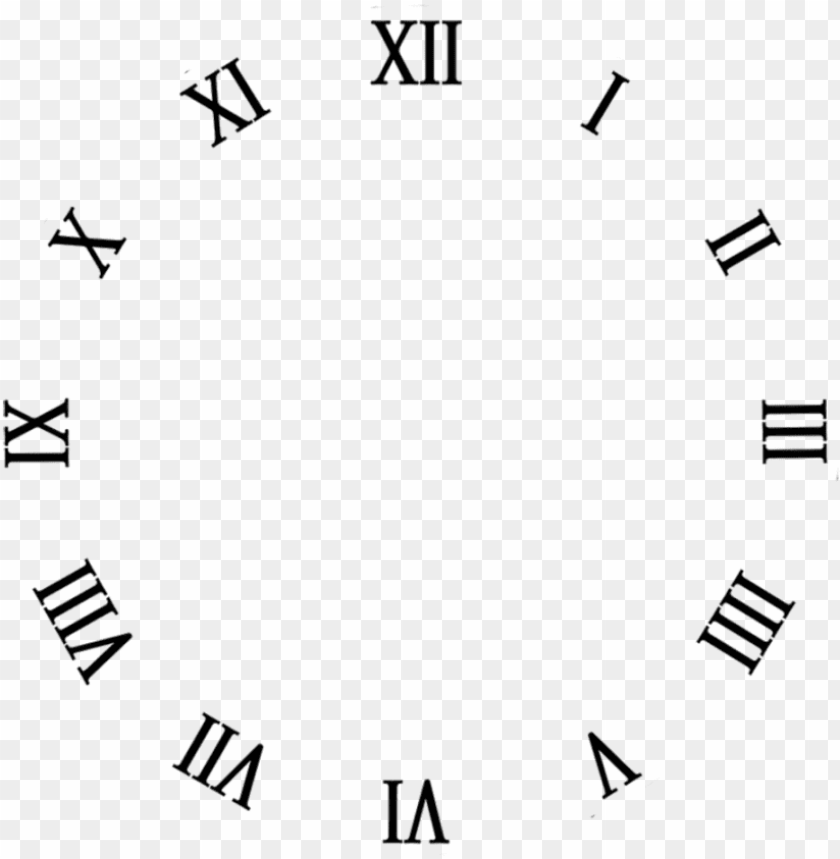

# Analog Clock



The Analog Clock is a simple, interactive clock application that displays the time in a traditional analog format. This project aims to provide a visually appealing and user-friendly representation of the current time, making it easy for users to quickly glance at the clock and understand the time.

## Technologies Used

- HTML5: The structure and layout of the clock are built using HTML5.

- CSS3: CSS3 is used for styling the clock elements and providing animations.

- JavaScript: The interactive functionality and real-time updates are implemented using JavaScript.

## Usage

1. Clone the repository to your local machine.

   ```bash
   git clone https://github.com/your-username/analog-clock.git
